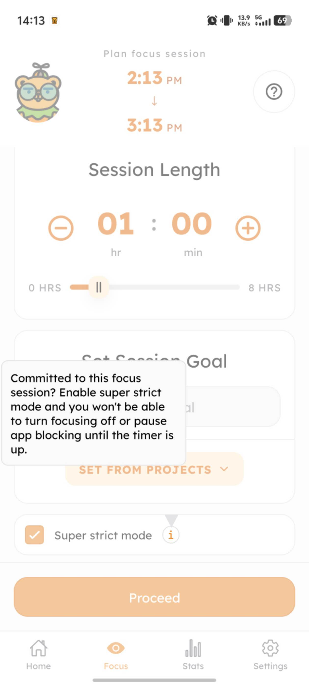
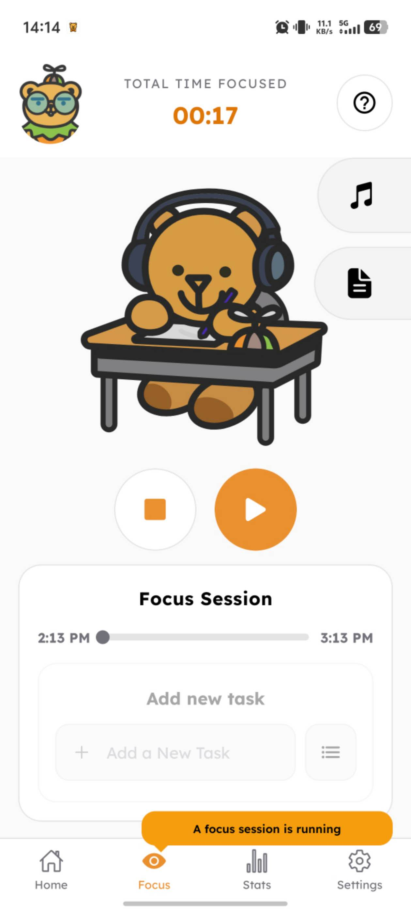
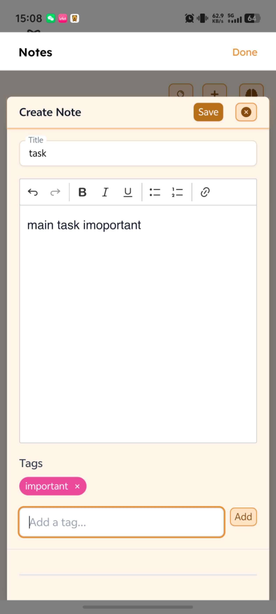
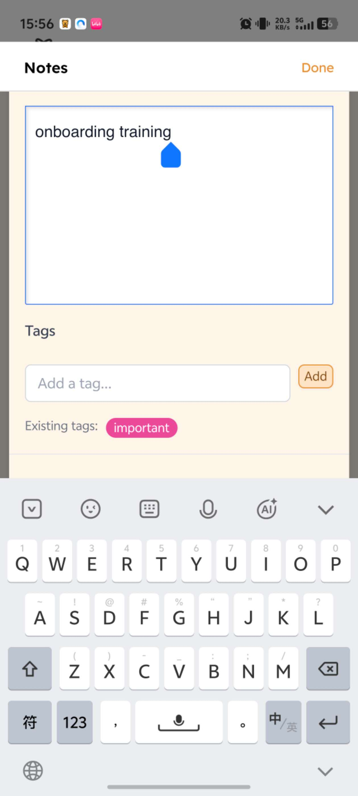
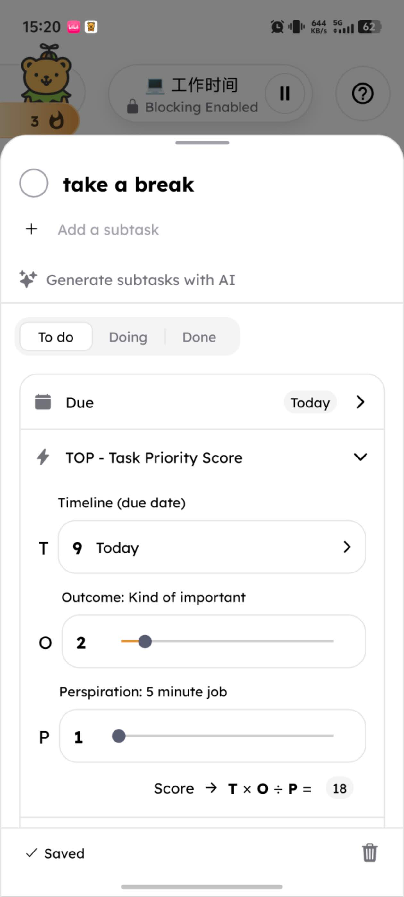
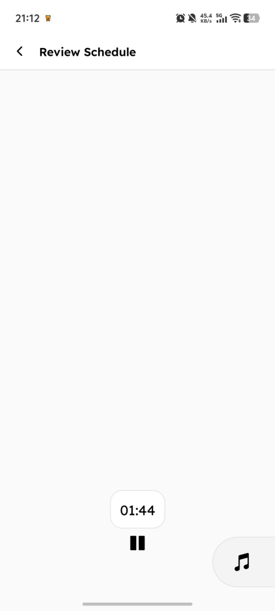
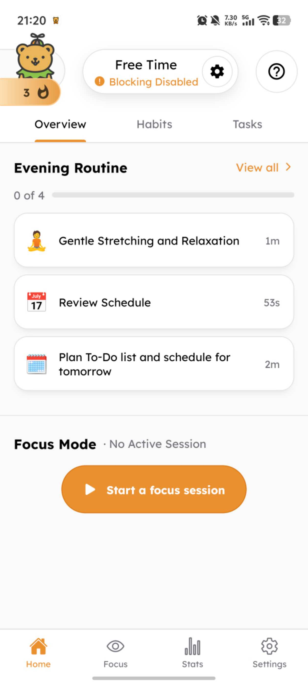

# 1.2 First-Time User Experience Assignment — Focus Bear App

Reflection

I approached the Focus Bear app as a brand-new user who had never seen it before. Overall, the core habit and task management flow is functional, but I ran into several moments of confusion — some caused by actual bugs (functionality not matching what was described), and others caused by unclear UI/visual design choices. Below are the 5 issues I found, each with steps to reproduce and a suggested fix. I also logged these as bug reports / improvement ideas on team.focusbear.io.

Issue 1: Super Strict Mode can be stopped mid-session

What went wrong or was confusing? The description for Super Strict Mode states that once a focus session starts, it cannot be stopped until the set time is up. However, in practice, the stop/close button still works normally during the session, allowing the user to exit early — contradicting the stated behavior.

Steps to reproduce

Open the Focus Bear app and go to focus mode settings.
Enable Super Strict Mode.
Read the description stating the session cannot be stopped early.
Start the focus session.
Try tapping the stop/close button.
Result: the session closes successfully, which contradicts the description.

Suggested fix Fix the logic so the stop button is genuinely disabled/hidden while Super Strict Mode is active. If an emergency exit must exist for safety reasons, clearly state the exit conditions in the settings description instead of claiming it "cannot be stopped."

Issue 2: "Done" button on the Task notes page doesn't save content

What went wrong or was confusing? On the Task notes page, there are two buttons — a larger, more prominent "Done" button and a smaller "Save" button. Tapping "Done" does not save the note content; only tapping the smaller, less visible "Save" button actually saves it. This is misleading and can cause users to lose their notes.

Steps to reproduce

Open any Task and tap "Add Note."
Type in note content.
Tap the larger, more prominent "Done" button.
Exit and re-open the note.
Result: the note content was not saved.
Re-enter the note content and tap the smaller "Save" button instead.
Result: the note content is saved successfully.

Suggested fix Move the "Save" button to the bottom of the screen (the primary action position users expect), and either remove or de-emphasize "Done" — or have "Done" trigger a save automatically before closing, so users can't accidentally lose their notes.

Issue 3: Task priority score (T×O/P) is skewed too high for low-effort tasks

What went wrong or was confusing? When creating a task, the app calculates a priority score using Timeline (due date) × Outcome (importance) ÷ Perspiration (effort required). For example, for a task named "Rest for 5 minutes": Timeline = 9, Outcome = 2, Perspiration = 1, giving a score of 9×2÷1 = 18 — disproportionately high for a task that isn't especially important, since low-effort tasks get inflated by the division.

Steps to reproduce

Create a new task named "Rest for 5 minutes."
Set Timeline (due date) to "today" → system gives 9 points.
Set Outcome (importance) to "somewhat important" → system gives 2 points.
Set Perspiration (effort required) to "low" → system gives 1 point.
The system calculates the score as T×O/P = 18.
Result: a low-effort, not-particularly-important task ends up with an unexpectedly high priority score.

Suggested fix Reconsider the role of Perspiration in the formula — using it as a divisor causes low-effort tasks to be disproportionately inflated. Consider replacing the division with a weighted sum, applying score normalization/capping, or setting a minimum threshold for Perspiration to avoid extreme results.

Issue 4: Habit countdown screen feels visually plain

What went wrong or was confusing? The countdown screen for completing a daily habit only shows the habit name, a numeric countdown, and a music player button. There's no additional visual feedback such as a progress ring, motivational text, or habit-related tips — the screen feels visually plain and lacks engagement.

Steps to reproduce

Go to the Habit page.
Tap on a habit to start completing it.
Observe the countdown screen.
Result: only the habit name, numeric countdown, and a music player button are shown — no progress visualization or engaging content.

Suggested fix Add a circular progress ring around the countdown, display the current streak (e.g. "Day 7 🔥") to reinforce motivation, show rotating short tips or quotes relevant to the habit, and consider a breathing animation for relaxation-type habits. A brief encouraging message near the end of the countdown (e.g. "Almost there!") could also boost completion motivation.

Issue 5: "Blocking Disabled" warning icon on Home screen is unclear

What went wrong or was confusing? On the home screen, the "Free Time" status shows "Blocking Disabled" next to an orange warning (!) icon. As a new user, this looks like something is wrong, but it's unclear what "Blocking" actually refers to or why it's disabled by default.

Steps to reproduce

Open the app and land on the Overview/Home screen.
Look at the top status bar showing "Free Time."
Notice "Blocking Disabled" with a warning-style icon.
Result: unclear what this means or whether action is needed.

Suggested fix Add a brief tooltip or first-time explanation of what "Blocking" does and why it's off by default, or use a neutral icon instead of a warning-colored one to avoid implying an error.

Bug Reports Logged

All 5 issues above were also logged via the bug reporting form at team.focusbear.io (Help & Support → Bug Reporting), with annotated screenshots attached where available.
