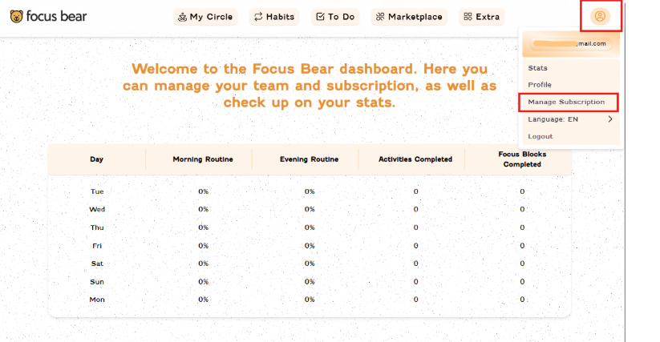
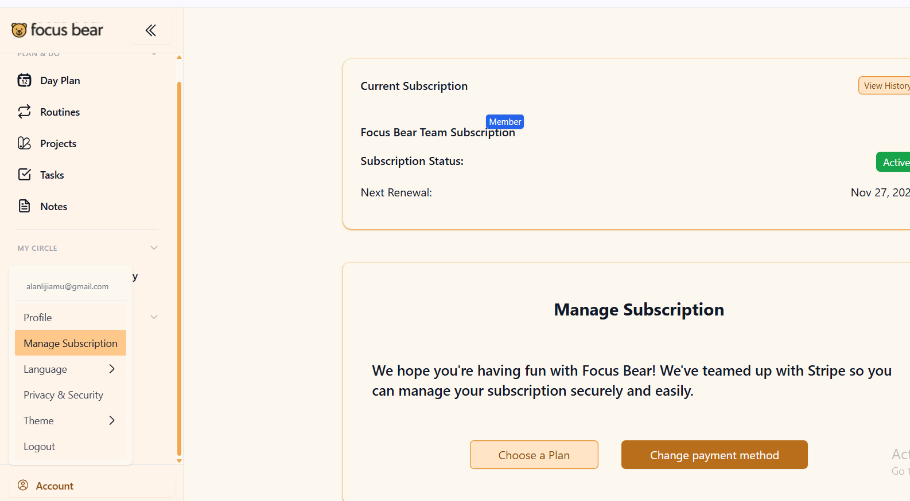

Get to Know the Focus Bear Product

3-5 Things About How the App Is Meant to Work (Relevant to My Role — Backend Development)
Blocking lists are persistent, per-user data. Users can permanently block specific apps/websites, and this needs to be stored and stay consistent across devices (desktop and mobile). From a backend perspective, this implies a per-user blocklist data model that supports sync across platforms.
Focus sessions behave like a state machine. A focus session has a clear lifecycle — start, in-progress, (optionally) stopped early, and end. This suggests the backend likely needs to track session state and timestamps (start/end time) both to enforce blocking behavior and to support usage stats/history.
Blocking Schedule relies on time-based automation. Users can set apps/sites to be automatically blocked at specific times without manually starting a focus session, which implies some kind of scheduler/cron-like logic rather than everything being purely triggered by manual user action.
The same setting (Strictness) is presented completely differently on Windows vs mobile. On Windows desktop, Strictness is "Cuddly Bear Mode" vs "Grizzly Bear Mode." On mobile, the same Strictness setting is instead framed as "Friction for skipping habits" ("Really easy" vs "Make it hard to skip," plus a password toggle) — a different UI, different wording, and arguably a different mental model for the same underlying purpose. Separately, "Super Strict Mode" is its own setting tied to focus sessions specifically, not part of Strictness. For the backend, this is a reminder that "the same feature" can have genuinely different data shapes/options per platform, and it's worth confirming with the team whether Windows and mobile Strictness settings are backed by the same field or intentionally separate ones.
AI is used to help decide website relevance. Focus Bear has an AI feature that can automatically judge whether a website aligns with the user's current task. This implies the backend likely needs to integrate with an AI service/API, which adds an extra data flow (sending context, receiving a relevance decision) beyond simple CRUD operations.

Reflection

What did you learn about the product that you didn't know before?

Before this task, I mainly understood Focus Bear at a surface level — a focus/habit app with a blocking feature. Going through the Help Centre, I learned there's a lot more structure underneath: the distinction between Pomodoro Breaks (5 minutes, unrestricted) and Micro Breaks (30-90 seconds, customizable, aimed at physical/mental recovery), the Blocking Schedule feature for automatic time-based blocking, and the existence of an AI feature that helps decide whether a website is relevant to the user's current task. I also learned that the desktop app has "Cuddly Bear Mode" and "Grizzly Bear Mode" as its strictness settings, which I hadn't seen before since I had only tested the mobile app previously.

Did you spot anything in the help centre that seems out of date or inconsistent with the current app?

Yes — I found that the Help Centre's coverage of "Strictness" only matches one platform. The article "Focus Bear Mode: Cuddly Bear Mode VS Grizzly Bear Mode" documents the Strictness setting as it appears on the Windows desktop app, which I confirmed still matches the current app. However, on mobile, the Strictness setting looks completely different — it's framed as "Friction for skipping habits," with options like "Really easy" vs. "Make it hard to skip," plus a separate password toggle, and no mention of "Cuddly Bear" or "Grizzly Bear" at all. Separately, I also noticed "Super Strict Mode," which is a distinct setting tied specifically to focus sessions rather than the general Strictness settings. So the Help Centre documents the Windows version of Strictness, but not the mobile version — a mobile user reading that article wouldn't be able to find the "Cuddly Bear/Grizzly Bear" options they're reading about anywhere in their app.

Separately, I also found an outdated screenshot/instructions issue on the dashboard side. The Help Centre's subscription management article instructs users to "hover over your profile icon located in the upper right corner" to find "Manage Subscription." This matches an older, simpler version of the dashboard (with just a top navigation bar). However, the current dashboard has been redesigned with a full left-hand sidebar (Day Plan, Routines, Projects, Tasks, Notes, My Circle, Account, etc.), and "Manage Subscription" can now also be accessed from the Account section in that left sidebar — a path the article doesn't mention at all. The top-right profile icon still works, but the article's instructions and implied UI no longer fully reflect the current dashboard design.

